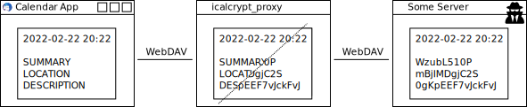

# iCalendar Encrypting WebDAV Proxy

    

This project implements a WebDAV proxy which forwards iCalendar (ics) data to an upstream host. However, private iCalendar events have their sensitive components encrypted. This way, you do not need to trust the upstream host. The proxy is supposed to run on a machine you trust. The client-supplied HTTP basic auth password is used for key derival and encryption. Encrypted fields are stored as base64 encoded strings. When fetching the iCalendar data, the data is decrypted on the fly.

This approach uses AES ECB encryption with fixed initialization vectors. This is by design. It makes the implementation susceptible to inference attacks. I want decryption to be possible with just the user password and I do not understand enough about cryptography to come up with a more secure solution of similar resiliency. I just want to make private events less readable to a snooping admin, not protect against the NSA. 😉

### Command-Line Parameters

* `category`: If this category is set on the event, it is encrypted (default: "Encrypt").
* `components`: These iCalendar event components are encrypted (default: "SUMMARY", "DESCRIPTION", "LOCATION", "ATTENDEE").
* `forward-auth`: Forward the HTTP basic auth information to the upstream host.
* `passphrase`: Do not use HTTP basic auth information. Use this password instead.
